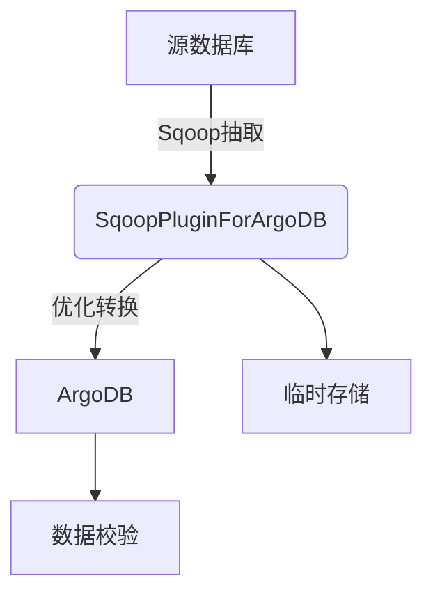

# SqoopPluginForArgoDB - ArgoDB Sqoop 连接器

[](LICENSE)

## 项目概述

SqoopPluginForArgoDB 是一个专为 ArgoDB 设计的高性能 Sqoop 连接器，它扩展了 Apache Sqoop 的功能，提供从传统关系型数据库到 ArgoDB 的高效数据迁移解决方案。

## 核心特性

### 🚀 高性能数据迁移
- 并行导入机制，充分利用 ArgoDB 的分布式特性
- 批量写入优化，显著提高数据传输效率
- 智能内存管理，处理大数据量时稳定可靠

### 🔌 多数据源支持
- MySQL 5.7+/8.0
- Oracle 11g/12c/19c
- PostgreSQL 9.5+
- SQL Server 2012+
- 其他支持 JDBC 的数据库

### 🛠️ 高级功能
- **大对象处理**：支持最大 3MB 的大字符串(Large String)
- **数据压缩**：支持 Snappy/ZLIB/LZF 压缩算法
- **断点续传**：任务失败后可从中断点恢复
- **实时监控**：提供详细的导入进度和性能指标

## 技术架构



## 快速入门

### 系统要求

- **Java**: JDK 1.8 或更高版本
- **Sqoop**: 1.4.7+ 或 CDH 5.x/6.x 自带版本
- **ArgoDB**: 2.0 及以上版本
- **Hadoop**: 2.7+ 或 CDH 5.x/6.x

### 安装步骤

1. 下载最新版本：
   ```bash
   wget https://github.com/yourusername/SqoopPluginForArgoDB/releases/download/v1.0.0/sqoop-argodb-plugin-1.0.0.jar
   ```

2. 部署插件：
   ```bash
   cp sqoop-argodb-plugin-1.0.0.jar $SQOOP_HOME/lib/
   ```

3. 验证安装：
   ```bash
   sqoop list-tools | grep argodb
   ```

### 基础使用示例

从MySQL导入数据到ArgoDB：

```bash
sqoop import \
    --connect jdbc:mysql://mysql01:3306/source_db \
    --username dbuser \
    --password dbpass \
    --table customers \
    --holotable argo_customers \
    --dblink-url "jdbc:argo://argodb-cluster:1234" \
    --dblink-user argouser \
    --dblink-password argopass \
    --compress \
    --compression-codec snappy \
    --large-string-enabled true \
    --large-string-max-size 2097152 \
    -m 8
```

### 参数说明

| 参数 | 说明 | 默认值 |
|------|------|--------|
| `--holotable` | ArgoDB目标表名 | 无 |
| `--dblink-url` | ArgoDB连接URL | 无 |
| `--dblink-user` | ArgoDB用户名 | 无 |
| `--dblink-password` | ArgoDB密码 | 无 |
| `--large-string-enabled` | 启用大字符串支持 | false |
| `--large-string-max-size` | 最大字符串大小(字节) | 3145728 |
| `--compress` | 启用压缩 | false |
| `--compression-codec` | 压缩算法(snappy/zlib/lzf) | snappy |
| `--tmp-dir` | 临时文件目录 | /tmp |

## 高级配置

### 性能调优

```properties
# 在sqoop-site.xml中添加以下配置
<property>
  <name>argodb.batch.size</name>
  <value>5000</value>
  <description>每批次写入记录数</description>
</property>

<property>
  <name>argodb.parallel.writers</name>
  <value>4</value>
  <description>并行写入线程数</description>
</property>
```

### 安全配置

```bash
# 使用密钥文件代替明文密码
sqoop import \
    ... \
    --dblink-password-file /path/to/password.txt
```

## 最佳实践

1. **分区策略**：对大表使用`--split-by`参数指定分区键
2. **数据类型映射**：在导入前确认源和目标数据类型兼容性
3. **网络优化**：确保Sqoop服务器与ArgoDB集群间网络通畅
4. **资源分配**：根据数据量合理设置`-m`参数控制并行度

## 常见问题

### Q: 导入过程中出现连接超时
A: 尝试增加超时设置：
```bash
--argodb.connection.timeout=600000
```

### Q: 如何处理特殊字符？
A: 使用转义参数：
```bash
--argodb.escape.char=\\
```

## 版本历史

| 版本 | 日期 | 主要更新 |
|------|------|----------|
| 1.0.0 | 2023-10-01 | 初始版本发布 |
| 1.1.0 | 2023-11-15 | 增加压缩支持 |
| 1.2.0 | 2023-12-20 | 优化大对象处理 |

## 贡献指南

我们欢迎各种形式的贡献！请阅读[CONTRIBUTING.md](CONTRIBUTING.md)了解详情。

1. 提交Issue报告问题或建议
2. Fork仓库并创建特性分支
3. 提交Pull Request
4. 确保所有测试通过
5. 更新相关文档

## 技术支持

- 📧 邮箱：support@argodb.com
- 💬 Slack：[加入我们的Slack频道](https://argodb.slack.com)
- 🐛 [问题追踪](https://github.com/yourusername/SqoopPluginForArgoDB/issues)

## 许可证

本项目采用 [Apache License 2.0](LICENSE) 开源协议。
